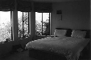
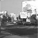
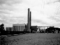

<h1>Project 3 results visualization</h1>

<h3>Implementation notes</h3>
Tiny image represention resizes images to 16x16 pixels, substracts their mean value and normalizes them.

Nearest neigbour classifier proved most effective with <i>k=1</i> parameter (that is only choosing a single nearest neigbour).

Support vector machine classifier proved most effective with <i>lambda=0.00001</i> parameter.

<i>vl_dsift()</i> function in <i>get_bags_of_words()</i> and <i>build_vocabulary()</i> was used with <i>fast</i> and <i>step=10</i> parameters to allow for faster result retrieval. Future enhancement would be to run the code with higher accuracy parameters.

<h3>Comparison</h3>

<table border=0 cellpadding=4 cellspacing=1>
<tr>
<th>Feature descriptor</th>
<th>Classifier</th>
<th>Accuracy</th>
<th>Results</th>
</tr>
<tr>
<td>Tiny image</td>
<td>Nearest neigbour <i>k=1</i></td>
<td>0.161</td>
<td><a href="../results_tiny_nn/index.md">link</a></td>
</tr>
<tr>
<td>Tiny image</td>
<td>Nearest neigbour <i>k=3</i></td>
<td>0.145</td>
<td><a href="../results_tiny_nn_k3/index.md">link</a></td>
</tr>
<tr>
<td>Bags of words <i>vocab_size=400</i></td>
<td>Nearest neigbour <i>k=1</i></td>
<td>0.476</td>
<td><a href="../results_bag_nn/index.md">link</a></td>
</tr>
<tr>
<td>Bags of words <i>vocab_size=400</i></td>
<td>SVM <i>lambda=0.00001</i></td>
<td><b>0.621</b></td>
<td><a href="../results_bag_svm_vocab400/index.md">link</a></td>
</tr>
</table>

<h3>Best result details</h3>

 
Accuracy (mean of diagonal of confusion matrix) is 0.621

<table border=0 cellpadding=4 cellspacing=1>
<tr>
<th>Category name</th>
<th>Accuracy</th>
<th colspan=2>Sample training images</th>
<th colspan=2>Sample true positives</th>
<th colspan=2>False positives with true label</th>
<th colspan=2>False negatives with wrong predicted label</th>
</tr>
<tr>
<td>Kitchen</td>
<td>0.500</td>
<td bgcolor=LightBlue></td>
<td bgcolor=LightBlue></td>
<td bgcolor=LightGreen></td>
<td bgcolor=LightGreen></td>
<td bgcolor=LightCoral> <small>InsideCity</small></td>
<td bgcolor=LightCoral> <small>TallBuilding</small></td>
<td bgcolor=#FFBB55> <small>Office</small></td>
<td bgcolor=#FFBB55> <small>Bedroom</small></td>
</tr>
<tr>
<td>Store</td>
<td>0.410</td>
<td bgcolor=LightBlue></td>
<td bgcolor=LightBlue></td>
<td bgcolor=LightGreen></td>
<td bgcolor=LightGreen></td>
<td bgcolor=LightCoral> <small>Kitchen</small></td>
<td bgcolor=LightCoral> <small>InsideCity</small></td>
<td bgcolor=#FFBB55> <small>InsideCity</small></td>
<td bgcolor=#FFBB55> <small>Office</small></td>
</tr>
<tr>
<td>Bedroom</td>
<td>0.370</td>
<td bgcolor=LightBlue></td>
<td bgcolor=LightBlue></td>
<td bgcolor=LightGreen></td>
<td bgcolor=LightGreen></td>
<td bgcolor=LightCoral> <small>LivingRoom</small></td>
<td bgcolor=LightCoral> <small>Industrial</small></td>
<td bgcolor=#FFBB55> <small>Kitchen</small></td>
<td bgcolor=#FFBB55> <small>LivingRoom</small></td>
</tr>
<tr>
<td>LivingRoom</td>
<td>0.320</td>
<td bgcolor=LightBlue></td>
<td bgcolor=LightBlue></td>
<td bgcolor=LightGreen></td>
<td bgcolor=LightGreen></td>
<td bgcolor=LightCoral> <small>InsideCity</small></td>
<td bgcolor=LightCoral> <small>Bedroom</small></td>
<td bgcolor=#FFBB55> <small>Office</small></td>
<td bgcolor=#FFBB55> <small>TallBuilding</small></td>
</tr>
<tr>
<td>Office</td>
<td>0.880</td>
<td bgcolor=LightBlue></td>
<td bgcolor=LightBlue></td>
<td bgcolor=LightGreen></td>
<td bgcolor=LightGreen></td>
<td bgcolor=LightCoral> <small>Bedroom</small></td>
<td bgcolor=LightCoral> <small>Industrial</small></td>
<td bgcolor=#FFBB55> <small>Bedroom</small></td>
<td bgcolor=#FFBB55> <small>Kitchen</small></td>
</tr>
<tr>
<td>Industrial</td>
<td>0.300</td>
<td bgcolor=LightBlue></td>
<td bgcolor=LightBlue></td>
<td bgcolor=LightGreen></td>
<td bgcolor=LightGreen></td>
<td bgcolor=LightCoral> <small>Kitchen</small></td>
<td bgcolor=LightCoral> <small>Kitchen</small></td>
<td bgcolor=#FFBB55> <small>Bedroom</small></td>
<td bgcolor=#FFBB55> <small>TallBuilding</small></td>
</tr>
<tr>
<td>Suburb</td>
<td>0.960</td>
<td bgcolor=LightBlue></td>
<td bgcolor=LightBlue></td>
<td bgcolor=LightGreen></td>
<td bgcolor=LightGreen></td>
<td bgcolor=LightCoral> <small>OpenCountry</small></td>
<td bgcolor=LightCoral> <small>Industrial</small></td>
<td bgcolor=#FFBB55> <small>InsideCity</small></td>
<td bgcolor=#FFBB55> <small>Office</small></td>
</tr>
<tr>
<td>InsideCity</td>
<td>0.530</td>
<td bgcolor=LightBlue></td>
<td bgcolor=LightBlue></td>
<td bgcolor=LightGreen></td>
<td bgcolor=LightGreen></td>
<td bgcolor=LightCoral> <small>LivingRoom</small></td>
<td bgcolor=LightCoral> <small>Store</small></td>
<td bgcolor=#FFBB55> <small>Kitchen</small></td>
<td bgcolor=#FFBB55> <small>TallBuilding</small></td>
</tr>
<tr>
<td>TallBuilding</td>
<td>0.800</td>
<td bgcolor=LightBlue></td>
<td bgcolor=LightBlue></td>
<td bgcolor=LightGreen></td>
<td bgcolor=LightGreen></td>
<td bgcolor=LightCoral> <small>Industrial</small></td>
<td bgcolor=LightCoral> <small>Industrial</small></td>
<td bgcolor=#FFBB55> <small>Coast</small></td>
<td bgcolor=#FFBB55> <small>Kitchen</small></td>
</tr>
<tr>
<td>Street</td>
<td>0.560</td>
<td bgcolor=LightBlue></td>
<td bgcolor=LightBlue></td>
<td bgcolor=LightGreen></td>
<td bgcolor=LightGreen></td>
<td bgcolor=LightCoral> <small>InsideCity</small></td>
<td bgcolor=LightCoral> <small>Kitchen</small></td>
<td bgcolor=#FFBB55> <small>TallBuilding</small></td>
<td bgcolor=#FFBB55> <small>Highway</small></td>
</tr>
<tr>
<td>Highway</td>
<td>0.800</td>
<td bgcolor=LightBlue></td>
<td bgcolor=LightBlue></td>
<td bgcolor=LightGreen></td>
<td bgcolor=LightGreen></td>
<td bgcolor=LightCoral> <small>Industrial</small></td>
<td bgcolor=LightCoral> <small>Mountain</small></td>
<td bgcolor=#FFBB55> <small>Coast</small></td>
<td bgcolor=#FFBB55> <small>Suburb</small></td>
</tr>
<tr>
<td>OpenCountry</td>
<td>0.280</td>
<td bgcolor=LightBlue></td>
<td bgcolor=LightBlue></td>
<td bgcolor=LightGreen></td>
<td bgcolor=LightGreen></td>
<td bgcolor=LightCoral> <small>Bedroom</small></td>
<td bgcolor=LightCoral> <small>Industrial</small></td>
<td bgcolor=#FFBB55> <small>Forest</small></td>
<td bgcolor=#FFBB55> <small>Forest</small></td>
</tr>
<tr>
<td>Coast</td>
<td>0.830</td>
<td bgcolor=LightBlue></td>
<td bgcolor=LightBlue></td>
<td bgcolor=LightGreen></td>
<td bgcolor=LightGreen></td>
<td bgcolor=LightCoral> <small>OpenCountry</small></td>
<td bgcolor=LightCoral> <small>OpenCountry</small></td>
<td bgcolor=#FFBB55> <small>Forest</small></td>
<td bgcolor=#FFBB55> <small>Suburb</small></td>
</tr>
<tr>
<td>Mountain</td>
<td>0.850</td>
<td bgcolor=LightBlue></td>
<td bgcolor=LightBlue></td>
<td bgcolor=LightGreen></td>
<td bgcolor=LightGreen></td>
<td bgcolor=LightCoral> <small>Store</small></td>
<td bgcolor=LightCoral> <small>Forest</small></td>
<td bgcolor=#FFBB55> <small>Highway</small></td>
<td bgcolor=#FFBB55> <small>Suburb</small></td>
</tr>
<tr>
<td>Forest</td>
<td>0.930</td>
<td bgcolor=LightBlue></td>
<td bgcolor=LightBlue></td>
<td bgcolor=LightGreen></td>
<td bgcolor=LightGreen></td>
<td bgcolor=LightCoral> <small>Highway</small></td>
<td bgcolor=LightCoral> <small>Coast</small></td>
<td bgcolor=#FFBB55> <small>Mountain</small></td>
<td bgcolor=#FFBB55> <small>Mountain</small></td>
</tr>
<tr>
<th>Category name</th>
<th>Accuracy</th>
<th colspan=2>Sample training images</th>
<th colspan=2>Sample true positives</th>
<th colspan=2>False positives with true label</th>
<th colspan=2>False negatives with wrong predicted label</th>
</tr>
</table>

<h2>Extra</h2>
<h3>Vocabulary size parameter (up to 3 pts)</h3>
Performance of bag of words feature representation in combination with SVM classifier has been tested under the following vocabulary size parameters:

<table border=0 cellpadding=4 cellspacing=1>
<tr>
<th>Vocabulary size</th>
<th>Accuracy</th>
<th>Results</th>
</tr>
<tr>
<td>10</td>
<td>0.401</td>
<td><a href="../results_vocab10/index.md">link</a></td>
</tr>
<tr>
<td>20</td>
<td>0.439</td>
<td><a href="../results_vocab20/index.md">link</a></td>
</tr>
<tr>
<td>50</td>
<td>0.550</td>
<td><a href="../results_vocab50/index.md">link</a></td>
</tr>
<tr>
<td>100</td>
<td>0.582</td>
<td><a href="../results_vocab100/index.md">link</a></td>
</tr>
<tr>
<td>200</td>
<td>0.596</td>
<td><a href="../results_vocab200/index.md">link</a></td>
</tr>
<tr>
<td>400</td>
<td><b>0.619</b></td>
<td><a href="../results_vocab400/index.md">link</a></td>
</tr>
<tr>
<td>1000</td>
<td>0.611</td>
<td><a href="../results_vocab1000/index.md">link</a></td>
</tr>
<tr>
<td>10000</td>
<td>0.586</td>
<td><a href="../results_vocab10000/index.md">link</a></td>
</tr>
</table>

As discovered, <i>the larger the vocabulary, the better the accuracy</i> is true up to size of 400. After that, there were too many clusters to bring an extra value, and the performance started to decrease.
<h3>Spatial Pyramid representation (up to 5 pts)</h3>
Performance of spatial pyramid feature representation in combination with SVM classifier has been tested under the following parameters:

<table border=0 cellpadding=4 cellspacing=1>
<tr>
<th>Vocabulary size</th>
<th>Pyramid level (height)</th>
<th>Accuracy</th>
<th>Results</th>
</tr>
<tr>
<td>20</td>
<td>0</td>
<td>0.439</td>
<td><a href="../results_vocab20/index.md">link</a></td>
</tr>
<tr>
<td>20</td>
<td>1</td>
<td>0.532</td>
<td><a href="../results_l1_vocab20/index.md">link</a></td>
</tr>
<tr>
<td>20</td>
<td>2</td>
<td>0.528</td>
<td><a href="../results_l2_vocab20/index.md">link</a></td>
</tr>
<tr>
<td>50</td>
<td>0</td>
<td>0.550</td>
<td><a href="../results_vocab50/index.md">link</a></td>
</tr>
<tr>
<td>50</td>
<td>1</td>
<td>0.579</td>
<td><a href="../results_l1_vocab50/index.md">link</a></td>
</tr>
</table>
